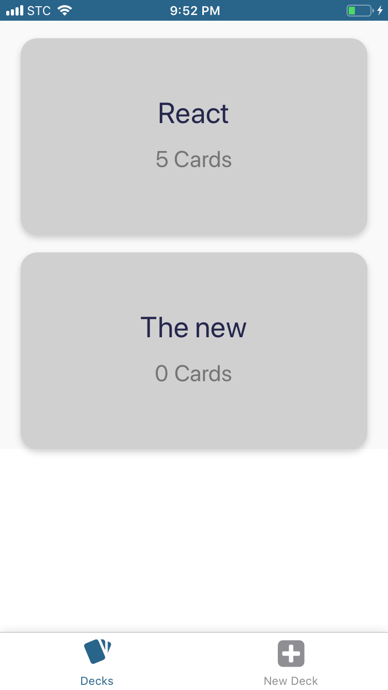
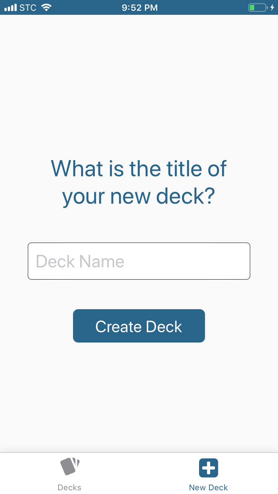
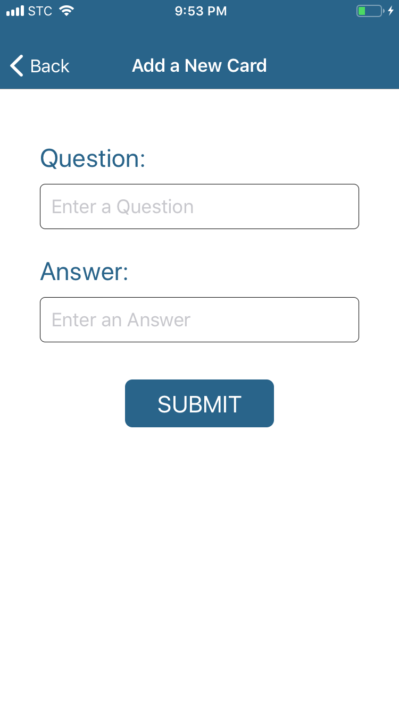
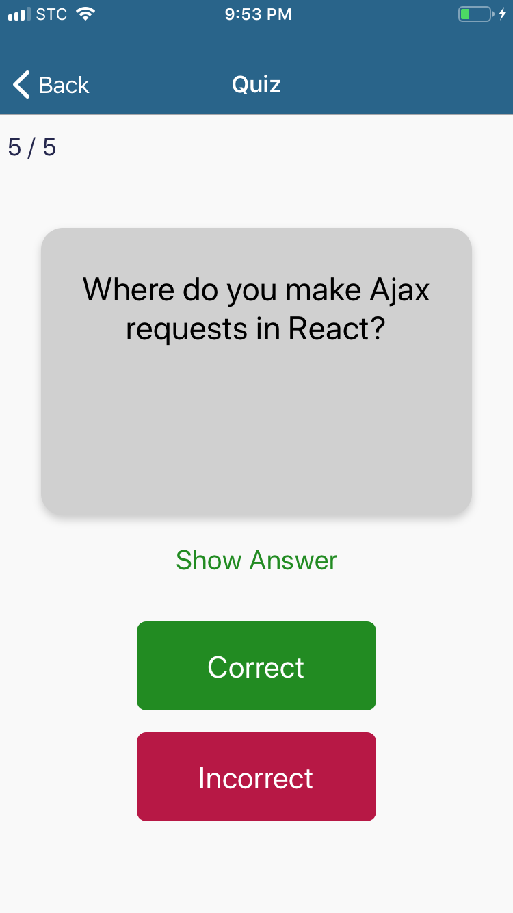

# Mobile Flashcards App


## Project Overview

This is a mobile application that allows users to study collections of flashcards. The app allows users to create different categories of flashcards called "decks", add flashcards to those decks, then take quizzes on those decks.

## Installing

This assumes that you have Expo installed. For more information, read the [Expo documentation](https://docs.expo.io/versions/latest/)

To run the project in your local machine:

* Download or clone the repository in your computer:
```
$ git clone https://github.com/asaadb/mobile-flashcards-app.git
```

* Navigate to the repository directory in your terminal

* Run the following code to install the development dependencies:

 ```
 yarn install
 ```

* start the development server with

```
yarn start
```
**Note:** Since this project is built with React Native, iOS and/or Android Simulator will need to be configured on the computer in order to view and test the app. You can also run this app on your phone by installing [Expo App](https://itunes.apple.com/app/apple-store/id982107779?ct=www&mt=8)


## Supported Platforms

While Mobile Flashcards App should work on all iOS and Android devices, it has been officially tested of the following devices:
- iPhone 6
- iPhone 7

## Screenshots

### Deck List View


### New Deck Form View


### Deck Detail View


### New Card Form View


### Quiz View



## Tools & dependencies

* [Expo](https://expo.io/)
* This project was bootstrapped with [Create React Native App](https://github.com/react-community/create-react-native-app).
* [Redux](https://github.com/reduxjs/redux)
* [React Redux](https://github.com/reduxjs/react-redux)
